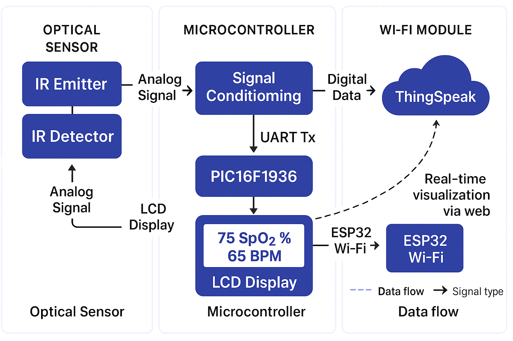

# IoT-Based Pulse Oximeter with PIC16F1936/37 and ESP32


---

## Project Overview

This repository presents the development of a **microcontroller-based pulse oximeter** with wireless data transmission via Wi-Fi, intended for remote health monitoring. The system was designed as part of a Bachelor's thesis in **Information and Communication Technology Engineering** at HTW Berlin.

It measures **SpO₂ (blood oxygen saturation)** and **BPM (heart rate)** using optical sensing and analog signal conditioning. A **PIC16F1937** microcontroller digitizes the signals and transmits them via UART to an **ESP32-C6**, which uploads the data to **ThingSpeak** for real-time cloud visualization.



---

**View Full Thesis (Web Viewer)**: 
[Read the full thesis as images](https://fbarquez.github.io/pulsoxi_iot/thesis/index_thesis.html)

**Live Demonstration Video**: 
[▶ Watch on Dropbox](https://www.dropbox.com/scl/fi/jzmq0wq67i9w6cfi0vw9p/FernandoBarrigaVasquez_videodesProjekts.mp4?rlkey=ytrc685q6z3rqatgajav5w1xa&st=frvmd6lj&dl=0)

---

## Features

- Real-time SpO₂ and BPM measurement
- Modular signal processing: sensor input, analog conditioning, digitization
- Wireless data transmission via ESP32 and Wi-Fi
- ThingSpeak dashboard with live charts
- Local LCD display for instant readings
- Custom-designed PCBs using EAGLE

---

## Folder Structure

```
├── docs/                  # Thesis report and web materials
├── firmware/              # Embedded code for PIC and ESP32
│   ├── pic/
│   └── esp32/
├── hardware/              # Schematics and PCB files
├── images/                # Photos and diagrams
├── LICENSE
├── NOTICE.md
├── README.md
└── requirements.md
```

---

## System Architecture

The system is divided into three functional modules:
...


### 1. Analog Front-End (AFE)
- **Components**: IR + Red LEDs, BPW34 photodiode
- **Signal Conditioning**: Low-pass/high-pass filters, current-to-voltage converter, amplifier

### 2. Microcontroller Unit (MCU)
- **Microcontroller**: PIC16F1937 with ADC and UART
- **Tasks**: Signal digitization, data formatting, LCD display update

### 3. Connectivity & Visualization
- **ESP32-C6**: UART receiver, Wi-Fi client
- **Cloud**: ThingSpeak channel for live plotting

---

## 🛠️ Hardware Design

The hardware was developed using **Autodesk EAGLE** and includes:

- Modular PCBs for:
  - Signal conditioning
  - Optical sensor input
  - Power regulation
- Schematic and board files (`.sch` / `.brd`) available in `hardware/eagle/`
- Rendered images and PDFs in `hardware/pdf/`

---

## Firmware and Software

### PIC16F1937 Firmware

- Developed in C using **MPLAB X IDE** with **MCC**
- Core features:
  - ADC configuration
  - UART transmission to ESP32
  - LCD driver integration

 Path: `firmware/pic/oxi_spo2_firmware/`

### ESP32 UART Receiver

- Written in **Arduino framework**
- Connects via UART to PIC
- Transmits data to ThingSpeak over Wi-Fi

 Path: `firmware/esp32/usart_relay_thingspeak.ino`

---

## Data Transmission & Visualization

- **ThingSpeak** IoT platform:
  - Channel with 2 fields: SpO₂ (%) and BPM
  - Real-time data plotted in the dashboard

- **LCD Output**:
  - Displays BPM and oxygen level locally

---

## Requirements

- [MPLAB X IDE](https://www.microchip.com/en-us/tools-resources/develop/mplab-x-ide)
- [MCC (Code Configurator)](https://www.microchip.com/mplab/mplab-code-configurator)
- [Arduino IDE](https://www.arduino.cc/en/software)
- ESP32 board support package
- [ThingSpeak account](https://thingspeak.com)

---

## Usage Instructions

### 1. Clone the repository

```bash
git clone https://github.com/yourusername/SpO2-Monitor-Project.git
cd SpO2-Monitor-Project
```

### 2. PIC Firmware

- Open `firmware/pic/oxi_spo2_firmware/` in MPLAB X
- Compile and flash to the PIC16F1937

### 3. ESP32 Code

- Open `firmware/esp32/usart_relay_thingspeak.ino` in Arduino IDE
- Configure your Wi-Fi credentials and ThingSpeak API key
- Upload to your ESP32 board

### 4. Dashboard

- Access your ThingSpeak channel to monitor live data
- Optionally view readings on the 16x2 LCD display

---

## License & Legal

This repository is provided **for educational and demonstration purposes only**.

> Not licensed for reuse, redistribution, or commercial use.

All content © 2024 fbarquez. 
See [`LICENSE`](LICENSE) for more details.
